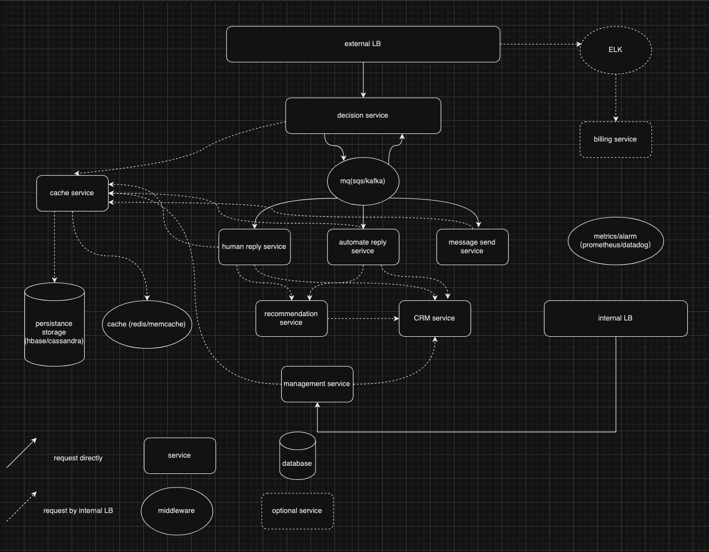
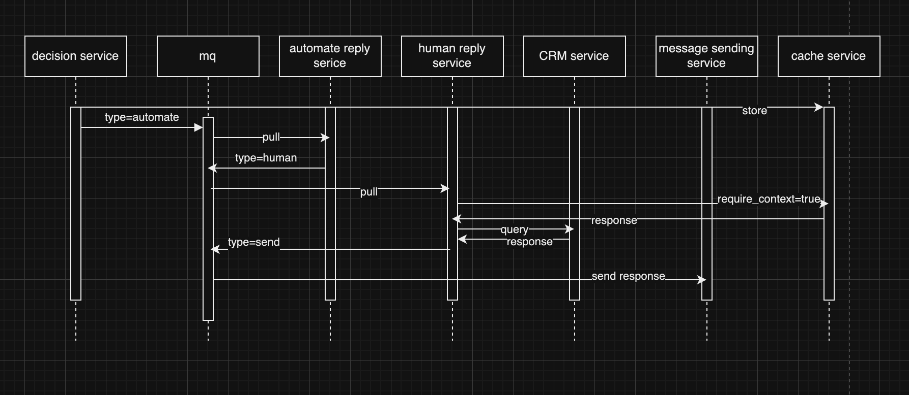

# System Design for AI-Based Bot Platform

## goal

1. Support self host deploy & partial self host deploy
1. Event driven & Reactive architecture
1. Almost unlimited scalability

## diagram

- system architecture diagram

- an ordinary request sequence diagram

## data structure definition

[data structure definition](attachment/message.proto)

## deploy replica requirment for reliability

1. service/load balancer: at lease 2 replicas
2. redis: master/slave with sharding
3. kafka/cassandra: at lease 3 data nodes

## scalability analyzation

1. service: stateless
1. redis: can be sharding by userid or biz_id
1. kafka/cassandra: scalability by middleware self

## some explanation

1. Why MQ are used for inter-service communication instead of RPC?
   
   In fact, I don't have a particularly strong inclination towards using MQ. However, considering the advantages of MQ, such as the ability to temporarily store requests when certain services are unavailable(for example, using queues for handling requests during peak human traffic), as well as benefits like decoupling communication between different services, I have chosen to use MQ. Nevertheless, considering factors such as maintainability and cost, using RPC is also a viable option.

2. how are self-host & partial self host manifested?

   `decision service` should offer an api to write MQ directly,
   so we can provide a service which we can name it `external serive` to 
   request service from ours instead of self-hosted